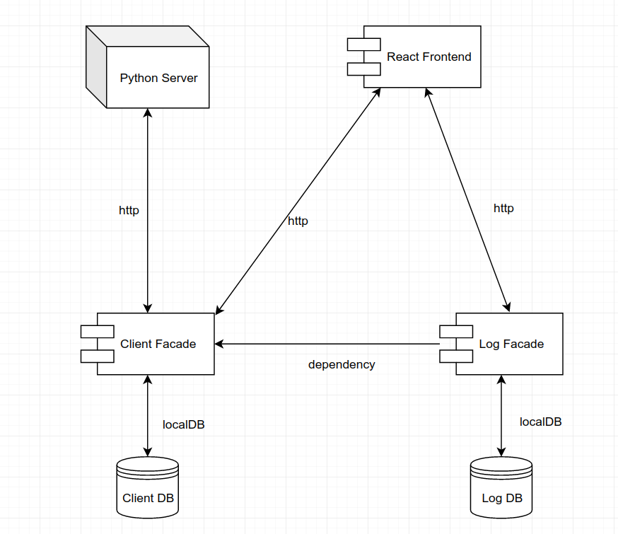

## Nossa aplicação consistirá em 4 módulos principais

### Servidor Python
Nosso servidor que vai conter os dados dos clientes, deve estar sincronizado com todos os clientes que dele consomem dados, será único para todos

| Endpoints                              |   Method      | Consumes  |  Produces  |       Result                      |
| ---------------------------------------|:-------------:|:---------:|:----------:|----------------------------------:|
| `/clients`                             |    GET        |     -     |   JSON     |Lista todos os clientes inseridos  |
| `/clients`                             |    POST       |   JSON    |     -      |Insere um novo cliente             | 

### Clientes Facade
Disponibilizará uma rota de criação de novos clientes, bem como consulta dos clientes já cadastrados

| Endpoints                              |   Method      | Consumes  |  Produces  |       Result                      |
| ---------------------------------------|:-------------:|:---------:|:----------:|----------------------------------:|
| `/client`                              |    GET        |     -     |    JSON    |Lista todos os clientes inseridos  |
| `/client`                              |    POST       |   JSON    |     -      |Insere um novo cliente             |
| `/client?id=`                          |    GET        |    -      |    JSON    |Busca o cliente baseado em um id   |

### Log Facade
Que disponibilizará uma rota de recuperação de dados, bem como será incorporado ao módulo de cliente facade a fim de logar a latência da nossa api

| Endpoints                              |   Method      | Consumes  |  Produces  |       Result                  |
| ---------------------------------------|:-------------:|:---------:|:----------:|------------------------------:|
| `/logs`                                |    GET        |     -     |    JSON    |Lista todos os logs inseridos  |

### Frontend React 
Que consumira dos módulos de cliente e log a fim de apresentar os dados

## Arquitetura Proposta

  

