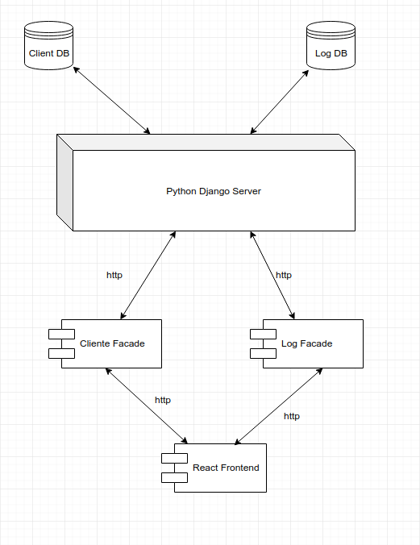

## Nossa aplicação consistirá em 3 módulos principais

### Servidor Python Django
    - Nosso servidor que vai conter os dados dos clientes cadastrados e dos logs registrados
    - Registrará os nossos micro-serviços de cliente-facade e log-facade

### Clientes Facade
    - Disponibilizará uma rota de criação de novos clientes, bem como consulta dos clientes já cadastrados

| Endpoints                              |   Method      | Consumes  |  Produces  |       Result                      |
| ---------------------------------------|:-------------:|:---------:|:----------:|----------------------------------:|
| `/client`                              |    GET        |     -     |    JSON    |Lista todos os clientes inseridos  |
| `/client`                              |    POST       |   JSON    |     -      |Insere um novo cliente             |
| `/client?id=`                          |    GET        |    -      |    JSON    |Busca o cliente baseado em um id   |

### Log Facade
    - Que disponibilizará uma rota de recuperação de dados, bem como será incorporado ao módulo de cliente facade a fim de logar a latência da nossa api

| Endpoints                              |   Method      | Consumes  |  Produces  |       Result                  |
| ---------------------------------------|:-------------:|:---------:|:----------:|------------------------------:|
| `/logs`                                |    GET        |     -     |    JSON    |Lista todos os logs inseridos  |

### Frontend React 
    - Que consumira dos módulos de cliente e log a fim de apresentar os dados
    - Apresentará formulário para criação de novo cliente
    - Grid para listagem de clientes
    - Gráficos para apresentação dos dados de log's

## Arquitetura Proposta

  
  
 
## Recursos

### Vídeos
    - https://www.youtube.com/watch?v=Q8eajxcS6dQ
    - https://www.youtube.com/watch?v=S9uPNppGsGo

### Artigos
    - https://medium.com/horadecodar/como-o-django-funciona-459184571a72
    - https://medium.com/@thais.ribeiro/introdu%C3%A7%C3%A3o-ao-django-come%C3%A7ando-um-projeto-do-zero-57a953e0614b
    - https://medium.com/@rinu.gour123/best-python-django-tutorial-for-beginners-advanced-2018-8944e900e1dd
    - https://medium.com/@nelziositoe/introducao-ao-django-rest-framework-47ecb9ae0e6b

### Bancos Sugeridos

#### Clientes Facade
    - Para o gerenciamento de clientes um banco relacional

| Clientes                     | Atributos  |  Tipo   |
| -----------------------------|:----------:|--------:|
| Id                           |    id      | Inteiro |
| Nome                         |   nome     | Texto   |

#### Log Facade
    - Para o gerenciamento de logs um banco documental como mongoDB por exemplo

### Docker
    - Docker é um software container da empresa Docker, Inc, que fornece uma camada de abstração e automação para virtualização de sistema operacional no Windows e no Linux, usando isolamento de recurso do núcleo do Linux como cgroups e espaços de nomes do núcleo, e um sistema de arquivos com recursos de união, como OverlayFS criando contêineres independentes para executar dentro de uma única instância do sistema operacional, evitando a sobrecarga de manter máquinas virtuais
    
#### Docker links

##### Vídeos
    - https://www.youtube.com/watch?v=0cDj7citEjE

##### Artigos
    - https://medium.com/trainingcenter/docker-o-que-%C3%A9-docker-e-como-come%C3%A7ar-58e04bdcb043
    - https://docs.docker.com/compose/django/

#### MongoDB

##### Artigos
    - https://docs.mongodb.com/ecosystem/use-cases/storing-log-data/

